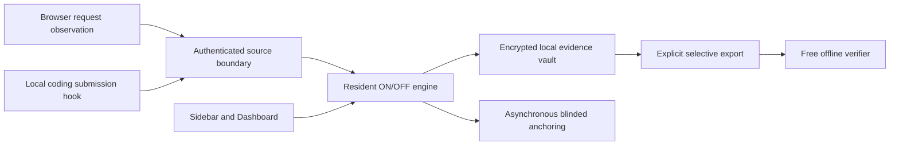

# Architecture and trust boundaries

Attestamp is a retrospective recorder. Supported client observations flow into one
resident engine, which owns consent, source authentication, local persistence and
asynchronous blinded anchoring. Provider Send remains under the provider client's
control. OFF denies new observations; it does not delete saved evidence.

| Source area | Responsibility |
| --- | --- |
| `spikes/core/` | Recording engine, consent epochs, integration/source registry and shared runtime |
| `spikes/browser/shared/`, `spikes/browser/chatgpt/` | Shared browser code, ChatGPT request projection, native framing and local views |
| `spikes/coding/` | Official hook projection, bounded admission, consented owned configuration and pinned executable identities |
| `spikes/platform/macos/` | Native peer validation and platform services |
| `spikes/vault/` | Immutable signed evidence, encrypted SQLite/object storage, bounded History and recovery |
| `spikes/recipient/` | Portable evidence readers and standalone verification |
| `spikes/anchor/`, `spikes/managed/` | Separate anchor assurance and blinded managed-service boundary |
| `spikes/distribution/` | Package inventories, signing/update trust, install/remove and rollback policies |

Views never acquire prompt-writing authority. Native transports authenticate peers;
source/document identities and consent generations prevent cross-source or stale
deliveries. Coding hooks perform a bounded fail-open in-memory handoff: they never
wait for durable save, network or anchoring. Prompt saved means durable encrypted
local evidence; ON alone is not proof of connection or completeness.

Historical evidence keeps its original versioned semantics and byte projection.
Retired send-execution workflows remain non-executable. Recovery restores evidence
with recording OFF; new integrations require explicit enrollment. The free verifier
and selective export do not require payment, an account or company availability.

The `spikes/` directory name is historical; these are the shared product components,
not a license to replace them with a parallel implementation. Read the detailed
[core boundaries](../spikes/core/README.md), [evidence vault](../spikes/vault/README.md)
and [recording semantics](../spikes/browser/chatgpt/RECORDING.md) before changing them.
